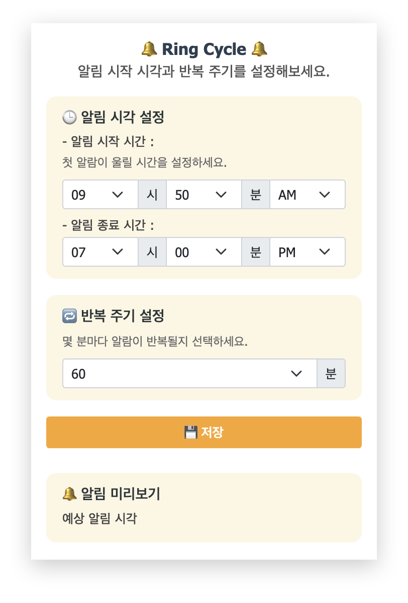
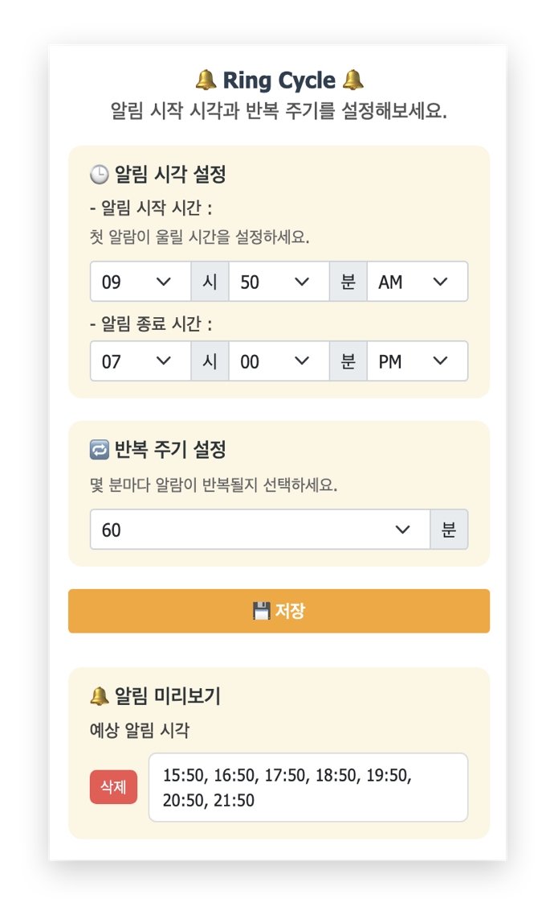

# 🔔 RingCycle - Custom Repeating Alarm Chrome Extension

<p align="center">
****  
</p>

**RingCycle**은 사용자가 지정한 시작 시각부터 일정한 간격으로 알림을 받을 수 있도록 도와주는 **크롬 확장 프로그램**입니다.

예를 들어, 시작 시간을 11:50, 반복 주기를 60분으로 설정하면 11:50, 12:50, 13:50… 이렇게 주기적으로 알림을 받을 수 있습니다.

---

## 📦 Features

- 시작 시각과 종료 시각 지정
- 반복 주기 설정 (10분 단위)
- 설정된 시간 목록을 기반으로 브라우저 알림 전송
- 저장된 알람 미리보기 및 삭제
- 부드럽고 직관적인 UI

---

## 🖼 UI Preview

> 크롬 확장 아이콘 클릭 시 표시되는 팝업 화면

<!-- <p align="center">
  
  
</p> -->

 <p align="center">
  
  
<p>

---

## 🔧 Tech Stack

- HTML / CSS / JavaScript
- [Bootstrap 5](https://getbootstrap.com/)
- Chrome Extensions API (Manifest v3)
  - `chrome.storage.local`
  - `chrome.alarms`
  - `chrome.notifications`
  - `background service worker`

---

## 🚀 Getting Started

TBD

---

## 📁 프로젝트 구조

```
📦 ringcycle/
├── src/               # 아이콘
│   └── ring-cycle-logo_*.png
├── lang/               # 언어화 (진행예정)
│   └── ko.json
├── script.js             # 알림 시간 계산 및 저장
├── service-worker.js     # 알람 트리거 및 알림 표시
├── index.html            # 팝업 UI
├── index.css             # 커스텀 스타일
├── format.js             # 시간 포맷 처리
└── manifest.json         # Chrome Extension 설정 파일
```

---

## 📝 TODO

- [x] 알림 사운드 옵션 추가
- [ ] 다크모드 UI 지원
- [ ] 로컬 시간대 자동 감지
- [ ] 알림 히스토리 로그 저장
- [ ] 다중 알림 스케줄 관리 기능
- [ ] 다중 언어화
- [ ] 방해 금지 모드
- [ ] 테스트 코드

---

## 👩‍💻 Author

**Yeokyeong An**  
기획, 개발, 디자인 진행한 사이드 프로젝트입니다.

---

## 📜 License

This project is licensed under the MIT License.
